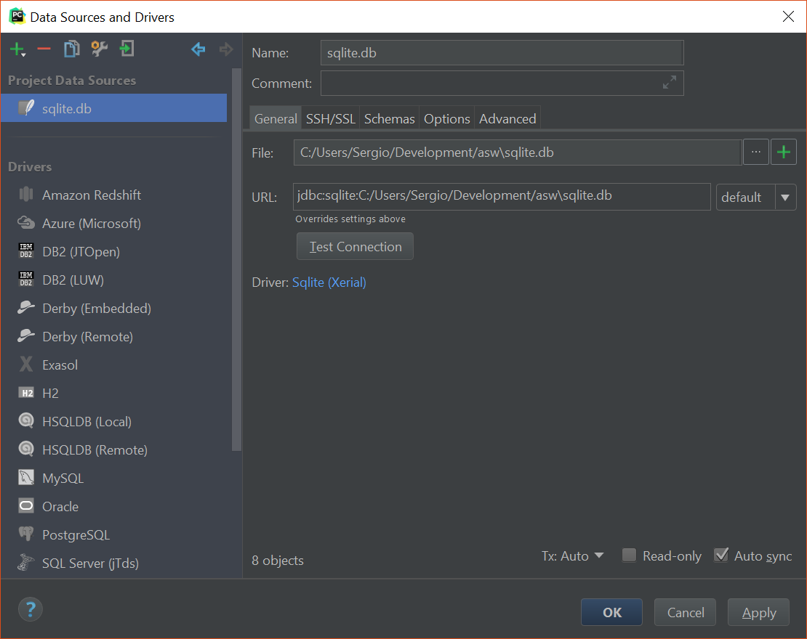
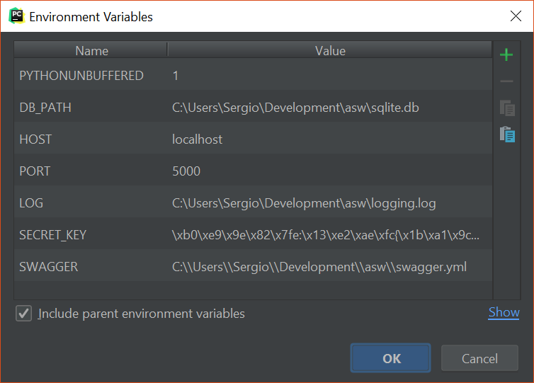

# Team members

* Alex Contreras
* Marc Lecha
* Pol Moya
* Sergio Paredes
* Joan Sanchez

# Basic setup

Download and install _Python 3.6_

Use `pip install -r requirements.txt` to install dependencies (global or in virtual environment)

Add following environment variables:

```
DB_PATH -> path to sqlite file
```

## PyCharm Setup

Create a new virtual environment following Jetbrains steps explained in the link [https://www.jetbrains.com/help/pycharm/configuring-python-interpreter.html.html](https://www.jetbrains.com/help/pycharm/configuring-python-interpreter.html.html).

Create new Sqlite database, double click on project folder, then _New_ > _Data Source_ as shown in next picture.


Enter a name for the database ended with _.db_ and select _Sqlite (Xerial)_ driver.


A new screen will appear, download the missing driver/update them if necessary. Make sure database works by clicking _Test Connection_ and finally click _Apply_ and _OK_.



Create a new run configuration, on the toolbar click _Run_ > _Edit Configurations..._. A window will appear, click on the plus button on the left upper side corner and a Python configuration. It should look similar to following picture.


Before closing this window add required variables, similar to next image.



Now you can run Pycharm configuration by pressing the button on the toolbar.


